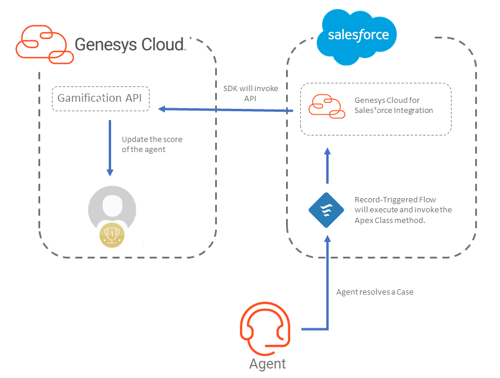
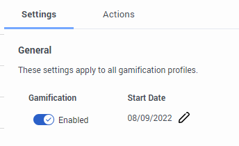
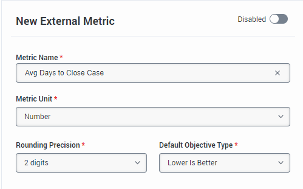
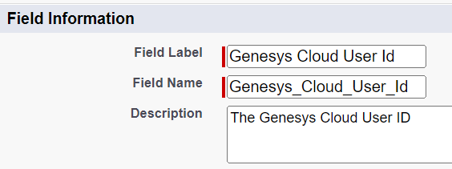
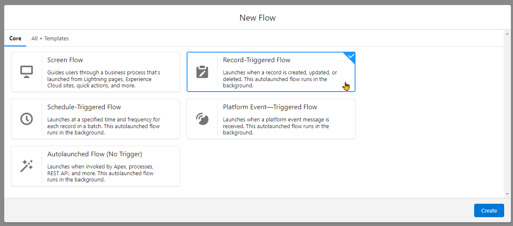
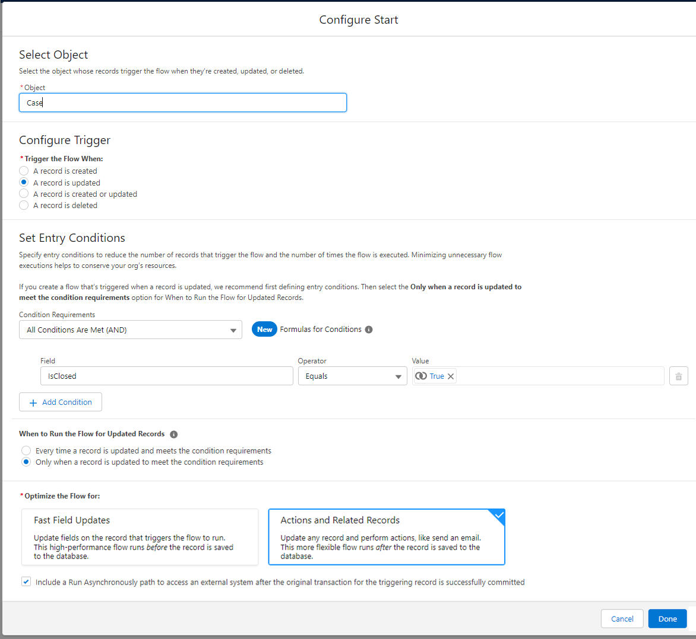
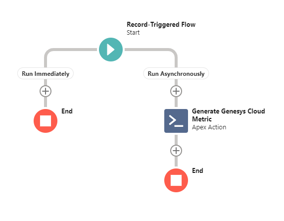
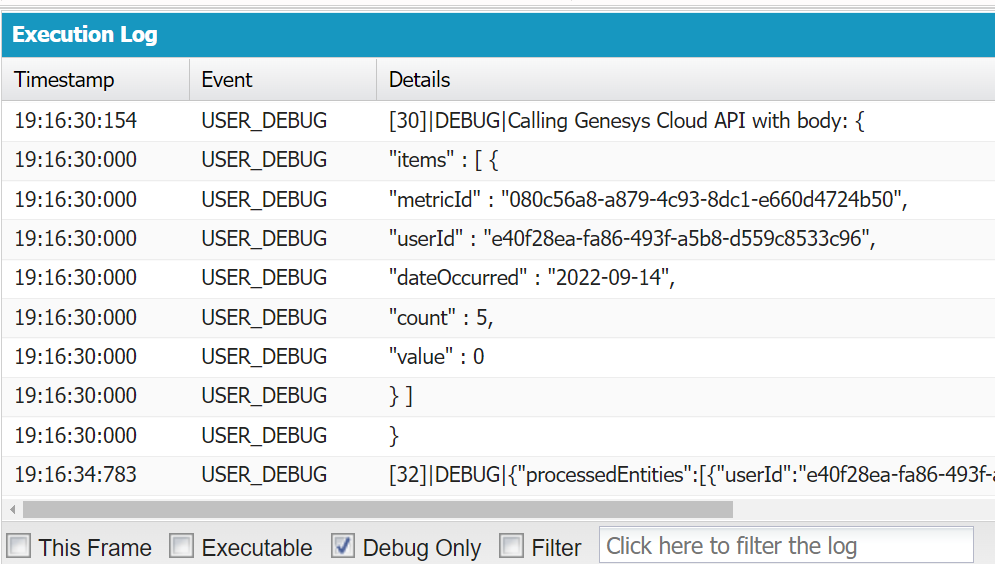

This Genesys Cloud Developer Blueprint demonstrates how to configure external metrics in Genesys Cloud and how to use the API to update the values from Salesforce or any 3rd-party system.



## Scenario

An organization using the Gamification features of Genesys Cloud wants to add external metrics to score and rank their agents.

In this blueprint, a Salesforce metric is used based on the average number of days a user takes to resolve a case.

The concept can similarly be used with any metric or with any 3rd-party system by invoking the Gamification API to send daily value updates.

## Solution components

* **Genesys Cloud** - A suite of Genesys cloud services for enterprise-grade communications, collaboration, and contact center management. In this solution, you require a Genesys Cloud user account to authorize the Vue app integration with Genesys Cloud.
* **Salesforce** - The Salesforce cloud customer relationship management (CRM) platform.
* **Genesys Cloud for Salesforce managed package** - The managed package that contains all the installation components, including the Genesys Cloud for Salesforce SDK, necessary to run Genesys Cloud for Salesforce.
* **Genesys Cloud for Salesforce SDK** - Allows you to customize actions in Genesys Cloud for Salesforce. This SDK is included in the managed package and uses the Salesforce Apex programming language.

## Prerequisites

### Specialized knowledge

* Administrator-level knowledge of Genesys Cloud
* Administrator-level knowledge of Salesforce and programming experience with Apex code

### Genesys Cloud account requirements

* A Genesys Cloud license. For more information, see [Genesys Cloud Pricing](https://www.genesys.com/pricing "Opens the Genesys Cloud pricing page").
* [Genesys Cloud 3 license](https://www.genesys.com/pricing "Genesys Cloud 3 license") or [Genesys Cloud User 1 WEM Upgrade II](https://appfoundry.genesys.com/filter/genesyscloud/listing/814c259b-7e36-48e6-b6d2-5355b4146227 "Genesys Cloud User 1 WEM Upgrade II") or [Genesys Cloud User 2 WEM Upgrade I](https://appfoundry.genesys.com/filter/genesyscloud/listing/253f2cbb-5f9d-4349-a54e-1e8dd4a0f8a5 "Genesys Cloud User 2 WEM Upgrade I")
* Master Admin role in Genesys Cloud. For more information, see [Roles and permissions overview](https://help.mypurecloud.com/?p=24360 "Opens the Roles and permissions overview article") in the Genesys Cloud Resource Center.
* An OAuth client with roles that are assigned the Gamification permissions. For more information, see [OAuth client permissions for Genesys Cloud for Salesforce](https://help.mypurecloud.com/?p=188903 "Opens the Genesys Cloud for Salesforce page") and [Create an OAuth client](https://help.mypurecloud.com/?p=188023 "Opens the resource page for creating an OAuth Client") in the Genesys Cloud Resource Center.

### Salesforce account requirements

* A Salesforce organization with the Genesys Cloud for Salesforce integration installed and configured. For more information, see [Install or upgrade the Genesys Cloud for Salesforce managed package](https://help.mypurecloud.com/?p=39356/ "Go to resource page for installing Genesys Cloud for Salesforce") and [Set up a call center in Salesforce](https://help.mypurecloud.com/?p=10593 "Go to page on setting up call center in Salesforce") in the Genesys Cloud Resource Center.
* The solutions engineer assigned a System Administrator profile. For more information, see Standard Profiles in the Salesforce documentation.

## Gamification API

Before implementing the sample, let's take a quick look at the ['Write External Metric Data' API endpoint](https://developer.genesys.cloud/devapps/api-explorer#post-api-v2-employeeperformance-externalmetrics-data "Go to API Explorer Gamification API "). This API allows us to update the daily value of an external metric.

Sample Body:

```JSON
{
    "items": [
        {
            "metricId": "aaaaaaa-aaaa-aaaa-aaaa-aaaaaaaaaaaa",
            "userId": "zzzzzzz-zzzz-zzzz-zzzz-zzzzzzzzzzzz",
            "dateOccurred": "2022-08-29",
            "value": 300,
            "count": 20
        }
    ]   
}
```

* `items` is an array containing update to a specific metric for a specific user. Multiple items in the array should be added for updating multiple metrics or multiple users.

* `dateOccurred` is the date of recording the specific metric value. You may set this date 7 days in the past and 30 days into the future. At the time of writing, invoking the API with the same date will override the `value` and `count` properties. Since the `value` will not automatically accumulate, it's expected that the data are pre-aggregated and finalized in the external system every time the API is called.

* `value` is the numerical value representing the metric. In this sample it will be the number of days it took to resolve the cases.

* `count` is the number of data points. In this sample it will be the number of cases resolved on the day.

Knowing how we can externally update a metric, let's now create an automated way for Salesforce to send these updates to Genesys Cloud.

## Implementation steps

### Turn on Gamification Settings on Genesys Cloud

By default, Gamification is turned off for the org. To turn it on, go to **Admin > Performance & Engagement > Gamification Settings** and enable the **Gamification** toggle.



### Create an External Metric in Genesys Cloud

First, create an external metric in Genesys Cloud.

1. Go to **Admin > Performance & Engagement > External Metric Definitions**
2. Enter the following details for the External Metric

    

3. Save and Activate the Metric
4. Take note of the **External ID** which will be used later in the Salesforce configuration.

### Add the metric to a Gamification Profile

Create a new Gamification Profile or use an existing one and add the metric that was just created.

1. Go to **Admin > Performance & Engagement > Gamification Profiles**
2. Create or edit an existing profile.
3. Under **Metrics** tab, add the previously created metric.
4. Since we're looking at the number of days an agent takes to close a case, select any of the `Lower is Better` options in the Metric's `Objective Type`.

### Create a custom User field in Salesforce to associate Genesys Cloud User ID

Salesforce needs to be able to associate the SFDC user with their Genesys Cloud user account. One way to do this is add a custom field for Users in Salesforce.

For a guide on how to add custom fields to objects, click [here](https://help.salesforce.com/s/articleView?id=sf.adding_fields.htm&type=5 "Go to guide for creating Custom Fields")

To keep the field consistent with the rest of the instructions please name the fields `Genesys_Cloud_User_Id`:



Also make sure to define the maximum length to at least 36 as Genesys Cloud User Ids (UUID format) tend to be that length.

### Create the Apex Class for processing the metric

1. From SFDC Setup, create a new Apex Class. [Official guide here](https://developer.salesforce.com/docs/atlas.en-us.apexcode.meta/apexcode/apex_qs_class.htm "Go to guide for creating an Apex Class").
2. Enter the following Apex script to the class editor:

    ```Java
    public class GenesysCloudGamification {
        
        // Execute the event of calling Genesys Cloud API to update metric values
        @InvocableMethod (label = 'Generate Genesys Cloud Metric')
        public Static void createEvent(List<GCCXMetricFlowInput> attributes) {
            GCCXMetricFlowInput input = attributes[0];
            string metricId = input.metricId;
            string gcUserId = input.gcUserId;
            string sfdcUserId = input.sfdcUserId;
            Date closed = Date.today();
            
            List<object> metrics = getMetrics(sfdcUserId);
            
            // Build the request body
            JSONGenerator gen = JSON.createGenerator(true);
            gen.writeStartObject();
            gen.writeFieldName('items');
            gen.writeStartArray();
            gen.writeStartObject();
            gen.writeStringField('metricId', metricId);
            gen.writeStringField('userId', gcUserId);
            gen.writeStringField('dateOccurred', formatDate(closed));
            gen.writeNumberField('count', (Integer)metrics[0]);
            gen.writeNumberField('value', (Integer)metrics[1]);
            gen.writeEndObject();
            gen.writeEndArray();
            gen.writeEndObject();
            
            // Invoke the GC API
            System.debug('Calling Genesys Cloud API with body: ' + gen.getAsString());
            HttpResponse response = purecloud.SDK.Rest.post('/api/v2/employeeperformance/externalmetrics/data', gen.getAsString());
            System.debug(response.getBody());
        }
        
        // Format Date to yyyy-mm-dd
        private static string formatDate(Date occurred) {
            integer intDay = occurred.day();
            integer intMonth = occurred.month();
            integer intYear = occurred.year();
            string day = String.valueOf(intDay);
            string month = String.valueOf(intMonth);
            string year = String.valueOf(intYear);
            
            if (intMonth < 10) {
                month = '0' + month;
            }
            
            return year + '-' + month + '-' + day;
        }
        
        // Get the total days before case resolution and the count of cases closed today.
        public static List<object> getMetrics(String sfdcUserId){
            Date closed = Date.today();
            List<Case> closedCases;
            List<object> metrics = New List<object>();
            try {
                closedCases = [SELECT CreatedDate FROM Case WHERE ClosedDate = LAST_N_DAYS:1 AND OwnerId = :sfdcUserId];
            }
            catch (DmlException e) {
                System.debug('getMetrics error: ' + e.getMessage());
            }
            integer count = closedCases.size();
            integer totalDays = 0;
            for (integer x=0; x<count; x++) {
                date created = date.newInstance(closedCases[x].CreatedDate.year(), closedCases[x].CreatedDate.month(), closedCases[x].CreatedDate.day());
                totalDays += created.daysBetween(closed);
            }
            
            metrics.add(count);
            metrics.add(totalDays);
            return metrics;
        }
        
        // Input data for the invocable method
        public class GCCXMetricFlowInput {
        @InvocableVariable(label='Metric ID' description='The Genesys Cloud Custom Metric ID' required=true)
        public string metricId;
        
        @InvocableVariable(label='Genesys Cloud User ID' description='The ID of the Genesys Cloud User' required=true)
        public string gcUserId;
        
        @InvocableVariable(label='SFDC User ID' description='The ID of the SFDC User' required=true)
        public string sfdcUserId;
        }
    }
    ```

3. Save the Apex class.

### Create the automated flow in Salesforce Flow Builder

Using Flow Builder, create a flow that will automatically run every time an SFDC user resolves or closes a Case.

1. From SFDC Setup, create a new Flow. [Official Guide here](https://help.salesforce.com/s/articleView?id=sf.flow_build.htm&type=5 "Go to official guide for building a flow").
2. Choose the `Record-Triggered Flow` as the Flow Type.

3. Configure the flow with the following settings:

4. In the `Run Asynchronously` branch, add the `Generate Genesys Cloud Metric` action and fill the form as follows:
    | Field                 | Value                                                     |
    |-----------------------|-----------------------------------------------------------|
    | Label                 | Generate Genesys Cloud Metric                             |
    | API Name              | Generate_Genesys_Cloud_Metric                             |
    | Genesys Cloud User ID | {!$Record.Owner:User.Genesys_Cloud_User_Id__c}            |
    | Metric ID             | *(Insert the Metric ID of the previously created metric)* |
    | SFDC User ID          | {!$Record.OwnerId}                                        |

The flow should look something like this:



5. Save and Activate the Flow.

Once the Flow is saved, you are now ready to test the integration.

## Test the integration

### Close a Case

1. Create a new case or use an existing one.
2. You may open the [SFDC Developer Console](https://help.salesforce.com/s/articleView?id=sf.code_dev_console.htm&type=5 "Open a page to the Developer Console Guide") to view the Genesys Cloud API in action.
3. Close the Case

If you had the Console open you will see the `Response` body of the API call after it was invoked through the Flow.


In the screenshot above, 5 cases were closed by the SFDC User on the day. The `value` is  0 since all cases were also created on the same day. If the cases were created on previous days, it will show the total number days for all 5 cases. Genesys Cloud will then take this data and get the average for all 5 as the final score for the day's metric.

If anything went wrong it will also show the error response from the API.

### Check the agent's scorecard

In Genesys Cloud, if you're logged in as the user go to **Activity** to show your updated scorecard.

## Additional resources

* [Gamification Overview](https://help.mypurecloud.com/articles/about-gamification/ "Gamification Overview")
* [Genesys Cloud for Salesforce](https://help.mypurecloud.com/articles/about-genesys-cloud-for-salesforce/ "Genesys Cloud for Salesforce")
* [Apex Developer Guide](https://developer.salesforce.com/docs/atlas.en-us.apexcode.meta/apexcode/apex_intro_what_is_apex.htm "Apex Developer Guide")
* [SFDC Flow Builder](https://help.salesforce.com/s/articleView?id=flow_builder.htm&language=en_US "SFDC Flow Builder")
